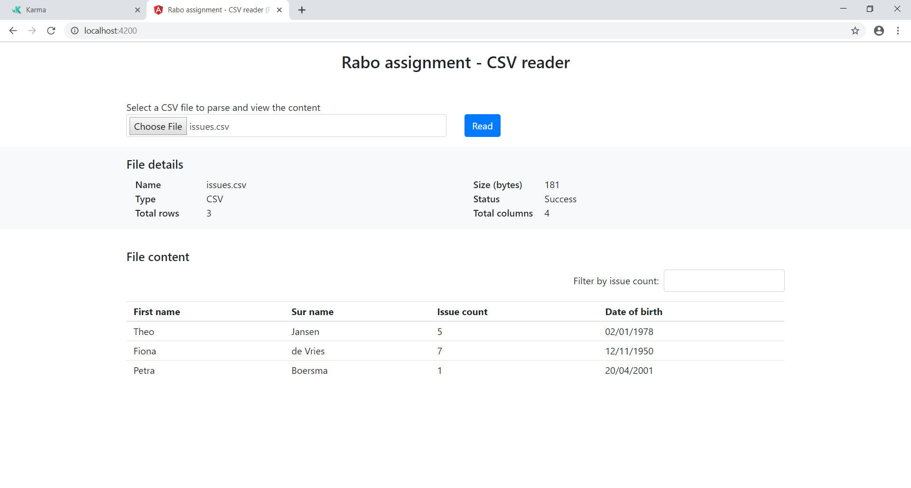
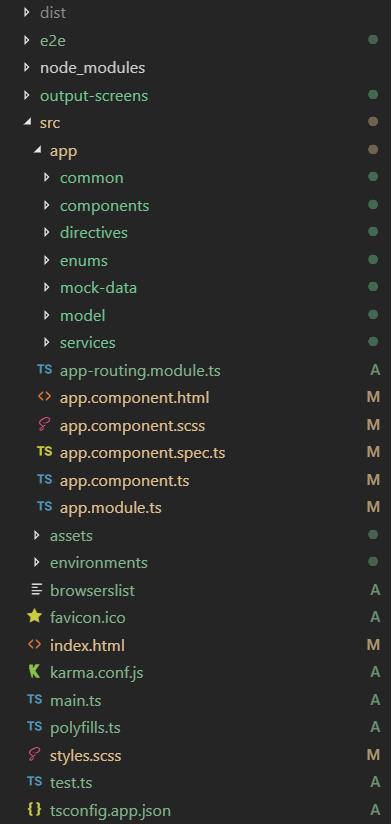

# Frontend CSV assignment


The CSV reader app will read the given CSV file and display the content on the screen. In addition to that we can filter the data based on Issue Count column. 

## Motivation

The motivation behind the creation of this app is to complete the front-end assignemnt provided by the interview panels. Due to which I got an opportunity to create `FileOperationService` and `RxReaderService` services.

Both the services can be reused and in future we can extend its scope to read more file types and consume via the services.

## Screenshot

CSV content displayed on the screen when Read button is clicked.
<p align="center">

</p>

## Code style

During development followed few best practices.

* Code simplicity
* Separation of concern
* Comments included for readability
* Reusability
* Unit testing
* Coding standards

## Technology/Framework used

* [Angular CLI](https://github.com/angular/angular-cli) [version: 7.3.8]
* [Angular](https://angular.io/) [version:7.2.0]
* [Bootstrap](https://getbootstrap.com/) [version: 4.3.1]
* [Jasmine](https://jasmine.github.io/)
* [NodeJS](https://nodejs.org/en/)
* [Typescript](https://www.typescriptlang.org/) [version: 3.2.2]

## Application Structure


<p align="center">

</p>

* dist folder - contains distribution package which can be readily used in production environment
* src folder - contains the full source of the application, which includes app code, configs, assets, etc.
* app folder - contains application feature specific code
* common folder - contains contants and other common files used all over the application. It will be reused across components, modules and services
* components folder - conaints two child components named `FileContentComponent` and `FileDetailComponent`
* directives folder - contains `NumberOnlyDirective` directive which can be used across application
* enums folder - contains `DataType` and `FileType` enum which is used to avoid hardcoding of constants and easy to compare the values in conditional statements
* mock-data folder - contains a mock `FileInfo` object, which is used in unit testing
* model folder - holds the `FileInfo` model which is the base object for the application to transfer the data across components
* services folder - contains `FileOperationService` and `RxReaderService` services

The app contains only one module with three components. `AppComponent` is the parent component, `FileContentComponent` and `FileDetailComponent` are child components. In other words we could say `AppComponent` act as Container component and the other two component act as Presentation components.

## Getting started

Below instructions will help you to get a copy of the project up and running on your local machine for development and testing purposes. 

### Prerequisites

### Installation

Clone the project using `git clone`

```
git clone <<git url>>
```
After cloning navigate into the project root folder and in the terminal type
```
npm install
```
After successfull installation of node modules, run the application with below command

```
npm start
```

These are the general steps involved to run the application in our local environment.  


### Running unit tests

Run `ng test` to execute the unit tests via [Karma](https://karma-runner.github.io).


## License

The MIT License

Permission is hereby granted, free of charge, to any person obtaining a copy
of this software and associated documentation files (the "Software"), to deal
in the Software without restriction, including without limitation the rights
to use, copy, modify, merge, publish, distribute, sublicense, and/or sell
copies of the Software, and to permit persons to whom the Software is
furnished to do so, subject to the following conditions:

The above copyright notice and this permission notice shall be included in all
copies or substantial portions of the Software.

THE SOFTWARE IS PROVIDED "AS IS", WITHOUT WARRANTY OF ANY KIND, EXPRESS OR
IMPLIED, INCLUDING BUT NOT LIMITED TO THE WARRANTIES OF MERCHANTABILITY,
FITNESS FOR A PARTICULAR PURPOSE AND NONINFRINGEMENT. IN NO EVENT SHALL THE
AUTHORS OR COPYRIGHT HOLDERS BE LIABLE FOR ANY CLAIM, DAMAGES OR OTHER
LIABILITY, WHETHER IN AN ACTION OF CONTRACT, TORT OR OTHERWISE, ARISING FROM,
OUT OF OR IN CONNECTION WITH THE SOFTWARE OR THE USE OR OTHER DEALINGS IN THE
SOFTWARE.